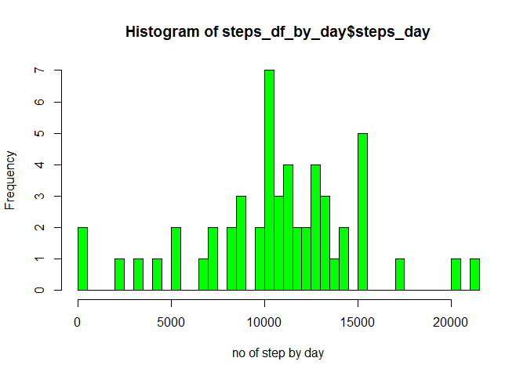
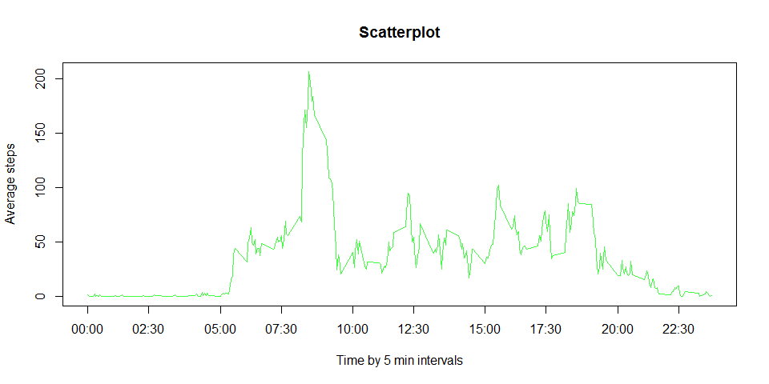
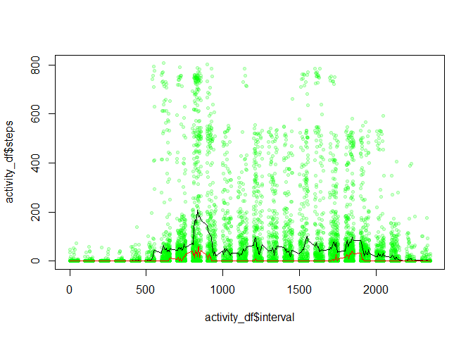
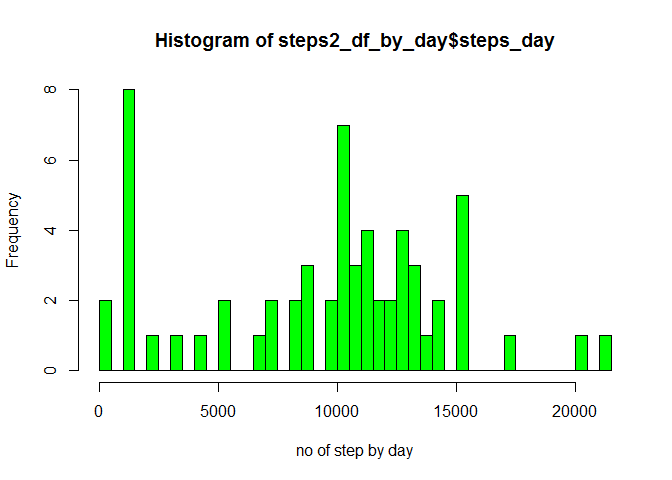
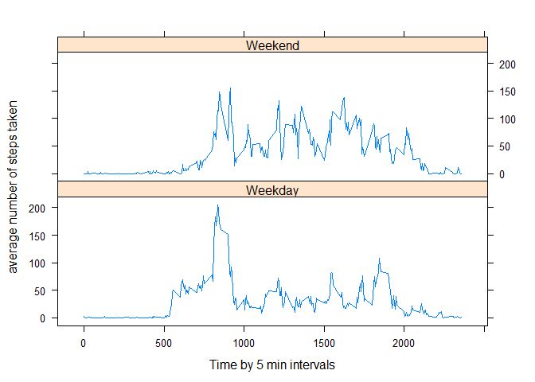

# Reproducible Research: Peer Assessment 1


## Loading and preprocessing the data
### Step 1
- below step requires activity.csv to be present in current working directory
- loading data from raw file


```r
library("dplyr")
```

```
## 
## Attaching package: 'dplyr'
## 
## The following object is masked from 'package:stats':
## 
##     filter
## 
## The following objects are masked from 'package:base':
## 
##     intersect, setdiff, setequal, union
```

```r
library("lubridate")
```

```
## Warning: package 'lubridate' was built under R version 3.1.3
```

```r
activity_df <- read.csv(file = "./activity.csv", header=TRUE) %>%
                tbl_df() %>%
			mutate(date = ymd(date)) %>%
                        arrange(date, steps)
```

## What is mean total number of steps taken per day?
### Step 2.1
- remove na , arrange data by date and then count steps by day
- Calculating the total number of steps taken per day into new variable **steps_day**

```r
activity_df_by_day <-filter(activity_df,!is.na(steps)) %>%
        	group_by(date,add = FALSE) %>%
			summarize(steps_day = sum(steps))
activity_df_by_day
```

```
## Source: local data frame [53 x 2]
## 
##          date steps_day
## 1  2012-10-02       126
## 2  2012-10-03     11352
## 3  2012-10-04     12116
## 4  2012-10-05     13294
## 5  2012-10-06     15420
## 6  2012-10-07     11015
## 7  2012-10-09     12811
## 8  2012-10-10      9900
## 9  2012-10-11     10304
## 10 2012-10-12     17382
## ..        ...       ...
```
Inserting missing dates in data  

- creating dataframe of all calendar dates from 2012-10-01 to 2012-11-30  and merging the data with it.
- Dates with no steps will have missing in **steps_day** variable

```r
day_seq <-  data.frame(seq(min(activity_df$date),max(activity_df$date),"days"))
names(day_seq)[1] <- c("all_dates")
steps_df_by_day <- merge(day_seq,activity_df_by_day,by.x="all_dates",by.y="date",all=TRUE) %>%
        tbl_df()
steps_df_by_day
```

```
## Source: local data frame [61 x 2]
## 
##     all_dates steps_day
## 1  2012-10-01        NA
## 2  2012-10-02       126
## 3  2012-10-03     11352
## 4  2012-10-04     12116
## 5  2012-10-05     13294
## 6  2012-10-06     15420
## 7  2012-10-07     11015
## 8  2012-10-08        NA
## 9  2012-10-09     12811
## 10 2012-10-10      9900
## ..        ...       ...
```

### Step 2.2

- Histogram of the total number of steps taken each day


```r
num_of_obs <- nrow(steps_df_by_day)
num_of_obs
```

```
## [1] 61
```

```r
hist(steps_df_by_day$steps_day,breaks = num_of_obs, col="green", xlab="no of step by day")
```

 


```r
mean_steps <- round(mean(steps_df_by_day$steps_day, na.rm = TRUE),4)
mean_steps
```

```
## [1] 10766.19
```

```r
median_steps <- median(steps_df_by_day$steps_day, na.rm = TRUE)
median_steps
```

```
## [1] 10765
```

```r
options(scipen = 3, digits = 8)
```
### Step 2.3 reporting the values
- the mean of the total number of steps taken per day is **10766.1887**  
- the median of the total number of steps taken per day  is **10765**


## What is the average daily activity pattern?

### Step3.1 Time series plot
- data processing step, grouping data by interval and then summarizing steps by interval

```r
activity_df_by_interval <- filter(activity_df, !is.na(steps)) %>%
                group_by(interval, add=FALSE) %>%
                summarize(steps_by_interval =  mean(steps)) %>%
                        arrange(interval)
activity_df_by_interval
```

```
## Source: local data frame [288 x 2]
## 
##    interval steps_by_interval
## 1         0       1.716981132
## 2         5       0.339622642
## 3        10       0.132075472
## 4        15       0.150943396
## 5        20       0.075471698
## 6        25       2.094339623
## 7        30       0.528301887
## 8        35       0.867924528
## 9        40       0.000000000
## 10       45       1.471698113
## ..      ...               ...
```
- Generate the plot and label the axis in hour format


```r
plot(activity_df_by_interval$interval,activity_df_by_interval$steps_by_interval
     ,xlab="Time by 5 min intervals",ylab="Average steps",main="Scatterplot"
     ,xaxt="n",pch=20,type="n")

axis(1, at=c(0,230,500,730,1000,1230,1500,1730,2000,2230)
     ,labels=c("00:00","02:30","05:00","07:30","10:00","12:30","15:00","17:30","20:00"
               ,"22:30"),las=0)
lines(activity_df_by_interval$interval,activity_df_by_interval$steps_by_interval
      ,col=rgb(0,1,0,.75))
```

 
  
### Step3.2 Interval with Maximum number of steps
- find the maximum steps count and then filter that record from data

```r
library("dplyr")
max_step_df<- summarize(activity_df_by_interval,max_steps=max(steps_by_interval))
interval_max <- filter(activity_df_by_interval,round(steps_by_interval,2)==
                               round(max_step_df$max_steps,2))
interval_max
```

```
## Source: local data frame [1 x 2]
## 
##   interval steps_by_interval
## 1      835         206.16981
```

```r
#abline(v=interval_max$interval, col="red")
```
The max number of steps occurs at interval **835**


## Imputing missing values

### Step 4.1 total number of missing values in the dataset

run summary function we see only step var has missing values in it


```r
summary(activity_df)
```

```
##      steps              date               interval      
##  Min.   :  0.000   Min.   :2012-10-01   Min.   :   0.00  
##  1st Qu.:  0.000   1st Qu.:2012-10-16   1st Qu.: 588.75  
##  Median :  0.000   Median :2012-10-31   Median :1177.50  
##  Mean   : 37.383   Mean   :2012-10-31   Mean   :1177.50  
##  3rd Qu.: 12.000   3rd Qu.:2012-11-15   3rd Qu.:1766.25  
##  Max.   :806.000   Max.   :2012-11-30   Max.   :2355.00  
##  NA's   :2304
```

```r
num_miss_values <- nrow(filter(activity_df,is.na(steps)))
num_miss_values
```

```
## [1] 2304
```
the total number of missing values in the dataset 2304

### Step4.2 a strategy for filling in all of the missing values in the dataset

- Make a plot step vs interval with line marking average steps in intervals by days

- Calculate similar data for median and overap line on previous graph


```r
plot(activity_df$interval,activity_df$steps, col=rgb(0,1,0,0.20),pch=20)
lines(activity_df_by_interval$interval,activity_df_by_interval$steps_by_interval,col="black")
act_df_median <- filter(activity_df, !is.na(steps)) %>%
                group_by(interval, add=FALSE) %>%
                summarize(steps_by_interval =  median(steps)) %>%
                        arrange(interval)
lines(act_df_median$interval,act_df_median$steps_by_interval,col="red")
```

 

Since data has too many spread out values affecting the mean we take median as a reasonable imputation strategy. From the plot line(red) traces the data reasonably well.

###Step4.3 Create a new dataset that is equal to the original dataset but with the missing data filled in

- Join median values to the basic dataset and do the imputation where steps is `NA`


```r
activity_df_imputed <- merge(activity_df,act_df_median,by.x="interval",by.y="interval",all=TRUE) %>%
        tbl_df() %>%
                mutate(steps=ifelse(is.na(steps),steps_by_interval,steps)) %>%
		select(steps, date, interval) %>%
		arrange(date,interval)
activity_df_imputed
```

```
## Source: local data frame [17,568 x 3]
## 
##    steps       date interval
## 1      0 2012-10-01        0
## 2      0 2012-10-01        5
## 3      0 2012-10-01       10
## 4      0 2012-10-01       15
## 5      0 2012-10-01       20
## 6      0 2012-10-01       25
## 7      0 2012-10-01       30
## 8      0 2012-10-01       35
## 9      0 2012-10-01       40
## 10     0 2012-10-01       45
## ..   ...        ...      ...
```
###Step4.4 histogram of the total number of steps taken each day


```r
activity2_df_by_day <-group_by(activity_df_imputed,date,add = FALSE) %>%
			summarize(steps_day = sum(steps))

steps2_df_by_day <- merge(day_seq,activity2_df_by_day,by.x="all_dates",by.y="date",all=TRUE) %>%
        tbl_df()
num2_of_obs <- nrow(steps2_df_by_day)
num2_of_obs
```

```
## [1] 61
```

```r
hist(steps2_df_by_day$steps_day,breaks = num2_of_obs, col="green", xlab="no of step by day")
```

 

```r
mean2_steps <- round(mean(steps2_df_by_day$steps_day, na.rm = TRUE),4)
median2_steps <- median(steps2_df_by_day$steps_day, na.rm = TRUE)
```
Reporting the values
- the mean of the total number of steps taken per day is **9503.8689**  
- the median of the total number of steps taken per day  is **10395**

### the impact of imputing missing data on the estimates of the total daily number of steps
As expected imputation moved the mean which is now less than the new median.
Median was less affected by the imputation (As imputed value being median itself).


## Are there differences in activity patterns between weekdays and weekends?

### Step5.1 creating factor variable "weekday" and "weekend"


```r
library("lubridate")
activity3_df_imputed <- mutate(activity_df_imputed,day_type=ifelse(wday(date)==1 | wday(date)==7,"Weekend","Weekday"))
activity3_df_imputed
```

```
## Source: local data frame [17,568 x 4]
## 
##    steps       date interval day_type
## 1      0 2012-10-01        0  Weekday
## 2      0 2012-10-01        5  Weekday
## 3      0 2012-10-01       10  Weekday
## 4      0 2012-10-01       15  Weekday
## 5      0 2012-10-01       20  Weekday
## 6      0 2012-10-01       25  Weekday
## 7      0 2012-10-01       30  Weekday
## 8      0 2012-10-01       35  Weekday
## 9      0 2012-10-01       40  Weekday
## 10     0 2012-10-01       45  Weekday
## ..   ...        ...      ...      ...
```

###step5.2 panel plot containing a time series plot of the 5-minute interval (x-axis) and the average number of steps taken split by Weekend and weekday.


```r
activity3_df_by_interval<-group_by(activity3_df_imputed,day_type,interval, add=FALSE) %>%
                summarize(steps_by_interval =  mean(steps)) %>%
                        arrange(day_type,interval)
library(lattice)
xyplot(steps_by_interval~interval|day_type,data=activity3_df_by_interval,type="l"
       ,layout = c(1,2), xlab="Time by 5 min intervals", ylab = " average number of steps taken")
```

 

